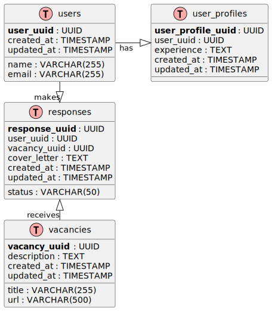

# ИИ агент для поиска релевантных вакансий

Минимальный прототип интеллектуального агента для поиска вакансий на hh.ru с ранжированием вакансий под пользователя.

---

## 🎯 Цель проекта

Создать систему, которая позволяет пользователю быстро находить релевантные вакансии и отправлять отклики с автоматически сгенерированными сопроводительными письмами.

---

## 📝 Задачи проекта

- Хранение информации о пользователях и их опыте.
- Сбор вакансий с hh.ru (название, описание, URL).
- Генерация сопроводительных писем с помощью ChatGPT.
- Ранжирование вакансий под пользователя с использованием API hh.ru.

---

## 🌐 REST API

| №  | Описание                                 | Endpoint                                                   | Method | Request Body / Params | Response | Authentication |
|----|-----------------------------------------|------------------------------------------------------------|--------|---------------------|----------|----------------|
| 1  | Регистрация нового пользователя         | `/api/v1/auth/register`                                    | POST   | `{ "name": "...", "email": "...", "password": "..." }` | `{ "user_uuid": "..." }` | ❌ |
| 2  | Вход пользователя                        | `/api/v1/auth/login`                                              | POST   | `{ "email": "...", "password": "..." }` | `{ "access_token": "..." }` | ❌ |
| 3  | Получение профиля пользователя           | `/api/v1/users/{user_uuid}/profile`                               | GET    | —                   | `{ "experience": "..." }` | ✅ |
| 4  | Сохранение профиля пользователя          | `/api/v1/users/{user_uuid}/profile`                               | POST   | `{ "experience": "..." }` | `{ "success": true }` | ✅ |
| 5  | Получение списка вакансий с ранжированием | `/api/v1/users/{user_uuid}/ranked_vacancies`                      | GET    | `?query=...&limit=10` | `[ { "vacancy_uuid": "...", "title": "...", "url": "..." } ]` | ✅ |
| 6  | Генерация сопроводительного письма       | `/api/v1/users/{user_uuid}/vacancies/{vacancy_uuid}/cover_letter` | POST   | `{ }`               | `{ "cover_letter": "..." }` | ✅ |
| 7  | Отправка отклика на вакансию с письмом   | `/api/v1/users/{user_uuid}/vacancies/{vacancy_uuid}/responses`    | POST   | `{ "cover_letter": "..." }` | `{ "success": true, "response_uuid": "..." }` | ✅ |

---

## 🗂 Структура базы данных

Минимальный набор таблиц для MVP:

| Таблица                  | Описание |
|---------------------------|----------|
| `users`                  | Информация о пользователях |
| `user_profiles`          | Опыт пользователя (`experience`) |
| `vacancies`              | Вакансии с hh.ru (название, описание, URL) |
| `responses`              | Отклики пользователей с сопроводительными письмами |

### ER-диаграмма базы данных

---

## 🛠 Технологии

## 🌐 REST API

| №  | Описание                                 | Endpoint                                | Method | Request Body / Params                       | Response | Authentication |
|----|-----------------------------------------|----------------------------------------|--------|--------------------------------------------|----------|----------------|
| 1  | Регистрация нового пользователя         | `/api/v1/users`                         | POST   | `{ "name": "...", "email": "...", "password": "..." }` | `{ "user_uuid": "..." }` | ❌ |
| 2  | Вход пользователя                        | `/api/v1/auth/login`                    | POST   | `{ "email": "...", "password": "..." }`   | `{ "access_token": "..." }` | ❌ |
| 3  | Получение информации о пользователе      | `/api/v1/users/{user_uuid}`             | GET    | —                                          | `{ "name": "...", "email": "...", "experience": "..." }` | ✅ |
| 4  | Обновление профиля пользователя          | `/api/v1/users/{user_uuid}`             | PATCH  | `{ "experience": "..." }`                 | `{ "success": true }` | ✅ |
| 5  | Получение списка вакансий с ранжированием | `/api/v1/users/{user_uuid}/vacancies`   | GET    | `?query=...&limit=10`                      | `[ { "vacancy_uuid": "...", "title": "...", "url": "..." } ]` | ✅ |
| 6  | Генерация сопроводительного письма       | `/api/v1/responses`                      | POST   | `{ "user_uuid": "...", "vacancy_uuid": "..." }` | `{ "cover_letter": "..." }` | ✅ |
| 7  | Отправка отклика на вакансию с письмом   | `/api/v1/responses`                      | POST   | `{ "user_uuid": "...", "vacancy_uuid": "...", "cover_letter": "..." }` | `{ "success": true, "response_uuid": "..." }` | ✅ |

---

## 🚀 Пользовательский сценарий

1. Регистрация и аутентификация пользователей.  
2. Создание профиля с опытом работы.  
3. Сбор вакансий с hh.ru и их хранение.  
4. Генерация сопроводительных писем с ChatGPT.  
5. Ранжирование вакансий через API hh.ru.  
6. Отправка откликов на вакансии через REST API.
